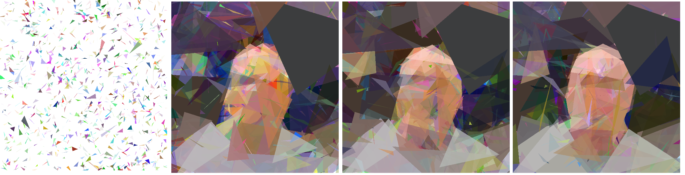
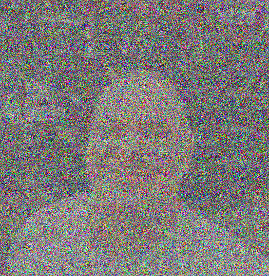
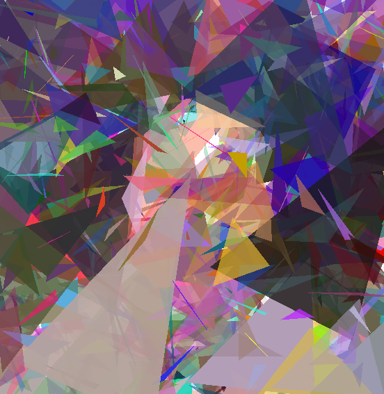
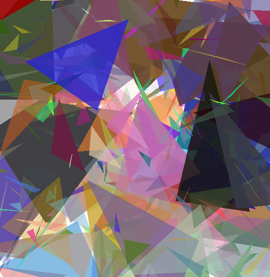

# Assignment 2 - Genetic Algorithm
    Peter Mavronicolas
    Old Dominion University
    CS 580, Fall 2022
    Dr. Yaohang Li
    11/13/2022

## Images
### Original Image
 
### Four Stages of the Gentic Algorithm: Generations 1, 1000, 1500, 2500
 
## Code

There are (3) files needed to run the genetic algorithm. 
* genetic_algo.py
* NatSelect.py
* triangles.py

The file genetic_algo.py contains the key functions to run the algorithm to include: 1) fitness 2) selection 3) mutate_image and 4) crossover. Variations of the output images are achieved by altering the # of triangles and population size. Code notes are preceeded by the line of code beginning with a '#'.
### genetic_algo.py
```commandline
from PIL import Image
from evol import Evolution, Population
import random
import os
from copy import deepcopy
from NatSelect import Color_Fill

# FITNESS function that measures difference from previous to current image as a score
def fitness(x: Color_Fill) -> float:
    current_fitness = x.image_diff(x.target_image)
    print(".", end='', flush=True)
    return current_fitness

#SELECTION function that selectively guesses new Color_Fill based on previous guesses
def selection(pop, maximize=False):
    evaluated_individuals = tuple(filter(lambda x: x.fitness is not None, pop))
    if len(evaluated_individuals) > 0:
        maternal = max(evaluated_individuals, key=lambda x: x.fitness if maximize else -x.fitness)
    else:
        maternal = random.choice(pop)
    paternal = random.choice(pop)
    return maternal, paternal

#function to randomly select inheritance of Color_Fill to either maternal or paternal
def choose_random(pop):
    maternal = random.choice(pop)
    paternal = random.choice(pop)
    return maternal, paternal

#GENETIC OPERATIONS: function that contains parameters that determine mutation rate

#MUTATION: mutation of a single individual
def mutate_image(x: Color_Fill, rate=0.04, swap=0.5, sigma=1) -> Color_Fill:
    x.mutate_triangles(rate=rate, swap=swap, sigma=sigma)
    return deepcopy(x)

#CROSSOVER: crossover of two individuals
def crossover(mom: Color_Fill, dad: Color_Fill):
    child_a, child_b = Color_Fill.crossover(mom, dad)

    return deepcopy(child_a)

#function to output images along with updated data while program is running
def console_output(pop, img_template="output%d.png", checkpoint_path="output") -> Population:
    avg_fitness = sum([i.fitness for i in pop.individuals])/len(pop.individuals)

    print("\nCurrent generation %d, best fitness %f, pop. avg. %f " % (pop.generation,
                                                                     pop.current_best.fitness,
                                                                     avg_fitness))
    # output conditions for image based on modulus value
    if pop.generation % 500 == 0 or pop.generation == 10:
        img = pop.current_best.chromosome.draw()
        img.save(img_template % pop.generation, 'PNG')

   # if pop.generation % 1000 == 0:
      #  pop.checkpoint(target=checkpoint_path, method='pickle')

    return pop

#conditional statement that defines location of image and output folder for image updates
if __name__ == "__main__":
    target_image_path = "./img/banksy.png"
    checkpoint_path = "./banksy/"
    image_template = os.path.join(checkpoint_path, "banksy_%05d.png")
    target_image = Image.open(target_image_path).convert('RGBA')
#variable values
    num_triangles = 400
    population_size = 20

    pop = Population(chromosomes=[Color_Fill(num_triangles, target_image, background_color=(255, 255, 255)) for _ in range(population_size)],
                     eval_function=fitness, maximize=False, concurrent_workers=6)
#defines early, mid, late and final stages of evolution based on given parameters

    stage_one = (Evolution()
                .survive(fraction=0.05)
                .breed(parent_picker=selection, combiner=crossover, population_size=population_size)
                .mutate(mutate_function=mutate_image, rate=0.05, swap=0.25)
                .evaluate(lazy=False)
                .callback(console_output,
                          img_template=image_template,
                          checkpoint_path=checkpoint_path))

#pop.evolve parameters set
    pop = pop.evolve(stage_one, n=10000)

```
### NatSelect.py

```commandline
from triangles import Triangle
from random import shuffle, randint
from PIL import Image, ImageDraw
from imgcompare import image_diff
import random

#class to determine how many triangles to fill, the target image to reach and background color of each triangle
class Color_Fill:
    def __init__(self, num_triangles, target_image, background_color=(0, 0, 0)):
        self._img_width, self._img_height = target_image.size
        self.triangles = [Triangle(self._img_width, self._img_height) for _ in range(num_triangles)]
        self._background_color = (*background_color, 255)
        self.target_image = target_image
#getter for background color
    @property
    def get_background_color(self):
        return self._background_color[:3]

# getter for image width
    @property
    def get_img_width(self):
        return self._img_width

# getter for image height
    @property
    def get_img_height(self):
        return self._img_height
#getter for # of triangles
    @property
    def num_triangles(self):
        return len(self.triangles)
#function to output statement for # of triangles
    def __repr__(self):
        return "Painting with %d triangles" % self.num_triangles

#function to mutate triangles
    def mutate_triangles(self, rate=0.04, swap=0.5, sigma=1.0):
        total_mutations = int(rate*self.num_triangles)
        random_indices = list(range(self.num_triangles))
        shuffle(random_indices)

        # for loop to mutate triangles through the number of random indices, i
        for i in range(total_mutations):
            index = random_indices[i]
            self.triangles[index].mutate(sigma=sigma)

# randomly swap two triangles
        if random.random() < swap:
            shuffle(random_indices)
            self.triangles[random_indices[0]], self.triangles[random_indices[1]] = self.triangles[random_indices[1]], self.triangles[random_indices[0]]
#function to create the triangles
    def draw(self, scale=1) -> Image:
        image = Image.new("RGBA", (self._img_width*scale, self._img_height*scale))
        draw = ImageDraw.Draw(image)
#conditional statement to determine color of triangle if attributes are missing
        if not hasattr(self, '_background_color'):
            self._background_color = (0, 0, 0, 255)
#create triangle of random size
        draw.polygon([(0, 0), (0, self._img_height*scale), (self._img_width*scale, self._img_height*scale), (self._img_width*scale, 0)],
                     fill=self._background_color)
#creates new_triangle, tdraw and tdraw.polygon
        for t in self.triangles:
            new_triangle = Image.new("RGBA", (self._img_width*scale, self._img_height*scale))
            tdraw = ImageDraw.Draw(new_triangle)
            tdraw.polygon([(x*scale, y*scale) for x, y in t.points], fill=t.color)

            image = Image.alpha_composite(image, new_triangle)

        return image
#defines a static method in the class Color_Fill for the function _mate_possible
    @staticmethod
    def _mate_possible(a, b) -> bool:
        return all([a.num_triangles == b.num_triangles,
                   a.get_img_width == b.get_img_width,
                   a.get_img_height == b.get_img_height])

# defines a static method in the class Color_Fill for the function crossover
    @staticmethod
    def crossover(a, b):
        if not Color_Fill._mate_possible(a, b):
            raise Exception("Cannot crossover images with different dimensions or number of triangles")
#declarations
        ab = a.get_background_color
        bb = b.get_background_color
        new_background = (int((ab[i] + bb[i])/2) for i in range(3))

        child_a = Color_Fill(0, a.target_image, background_color=new_background)
        child_b = Color_Fill(0, a.target_image, background_color=new_background)
#for loop with conditional statements return child a and child b
        for at, bt in zip(a.triangles, b.triangles):
            if randint(0, 1) == 0:
                child_a.triangles.append(at)
                child_b.triangles.append(bt)
            else:
                child_a.triangles.append(bt)
                child_b.triangles.append(at)

        return child_a, child_b
#function to output the new image
    def image_diff(self, target: Image) -> float:
        source = self.draw()

        return image_diff(source, target)
```
### triangles.py
```commandline
import random
#Establishes the size and color range (rgb 1-255) of each triangle
class Triangle:
    def __init__(self, img_width, img_height):
        x = random.randint(0, int(img_width))
        y = random.randint(0, int(img_height))
#adjusted triangle range from -50,50 to -10105 to increase evolution
        self.points = [
            (x + random.randint(-25, 25), y + random.randint(-25, 25)),
            (x + random.randint(-25, 25), y + random.randint(-25, 25)),
            (x + random.randint(-25, 25), y + random.randint(-25, 25))]
#color variation chosen for each point and color fill
        self.color = (
            random.randint(0, 256),
            random.randint(0, 256),
            random.randint(0, 256),
            random.randint(0, 256)
        )
#include self to access the attributes and methods of the class in python
        self._img_width = img_width
        self._img_height = img_height
#function returning an output statement of triangle # and color
    def __repr__(self):
        return "Triangle: %s in color %s" % (','.join([str(p) for p in self.points]), str(self.color))
#mutation parameters for triangle
    def mutate(self, sigma=1.0):
        mutations = ['shift', 'point', 'color', 'reset']
        weights = [30, 35, 30, 5]

        mutation_type = random.choices(mutations, weights=weights, k=1)[0]
#conditional statements
        if mutation_type == 'shift':
            x_shift = int(random.randint(-50, 50)*sigma)
            y_shift = int(random.randint(-50, 50)*sigma)
            self.points = [(x + x_shift, y + y_shift) for x, y in self.points]
        elif mutation_type == 'point':
            index = random.choice(list(range(len(self.points))))

            self.points[index] = (self.points[index][0] + int(random.randint(-50, 50)*sigma),
                                  self.points[index][1] + int(random.randint(-50, 50)*sigma),)
        elif mutation_type == 'color':
            self.color = tuple(
                c + int(random.randint(-50, 50)*sigma) for c in self.color
            )

            # Ensure color is within correct range
            self.color = tuple(
                min(max(c, 0), 255) for c in self.color
            )
        else:
            new_triangle = Triangle(self._img_width, self._img_height)

# include self to access the attributes and methods of the class in python
            self.points = new_triangle.points
            self.color = new_triangle.color
```

## Analysis

### Parameters
    Population size: 20
    No. of Triangles: 1000
    Crossover rate:
    Base Mutation rate: 0.04
    Swap: 0.5
    Sigma: 1.0
    Stage One Mutation rate: 0.05
    Swap: 0.25

### Fitness Function Implementation
    Test 1:
    Population size: 1000
    No. of Triangles: 150
    Random Triangle Range for each edge: -100,100
    Generations: 3000

    Test 2:
    Population size: 1000
    No. of Triangles: 50
    Random Triangle Range for each edge: -100,100
    Generations: 3000

    Test 3:
    Population size: 2000
    No. of Triangles: 1000
    Size of Triangle: 
    Random Triangle Range for each edge: -10,10
    Generations: 1000

    Test 4:
    Population size: 20
    No. of Triangles: 1000
    Random Triangle Range for each edge: -50,50
    Generations: 2500

After consulting with Dr. Li, I was advised to increase the number of triangles after initially making an attempt with 150 
triangles.Tests 1 and showed little difference from one another as the results from 1000 and 3000 generations showed no difference.
In Test 2, I decreased the number of triangles which had little to no effect on the outcome of the image. I had performed 
Test 2 with several evolutions (5) which caused an error when the 3rd evolution (removed from genetic_algo.py) was reached.
Test 3 also caused an error when the 3rd evolution was reached around 2000 generations. I then removed stage 2-5 of the 
evolutions, increased the number of triangles to 1000 and drastically decreased the population size to 20. This greatly 
increased the speed of generations and allowed for more rapid testing. It also resulted in a more detailed image which was
not reached in Tests 1-3.

### 27,000 Generations using GARI


After several initial runs using 150 triangles and a population of 20, stage_three in the evolution settings would result in a compiler error. I attributed this to a small population size. After limiting the stages to stage_one, I was able to increase the number of generations without error. I was also informed by Dr. Li that the image would be created faster by adjusting the number of triangles as opposed to the population size. I increased the number of triangles from 150 to 400 and also modified the range of the size of each random triangle generated from points ranging from (-50,50) to
(-25,25). Next, I made the triangles even smaller (-10,10) with no noticeable difference. An adjustment to the quantity of triangles per generation to 1000 increased the clarity of the image per generation.

### More, Smaller Triangles: 500 Generations

### Less, Larger Triangles: 500 Generations


By comparing the two images above, it's quite clear that the shoulders, face, and dark background are much more noticeable in the image with smaller triangles at a rate of 900 per generation as opposed to the larger triangles at a rate of 150 per generation.


## Work Cited
    1. 4dcu-be (Sept. 8, 2021). Genetic-Art-Algorithm [Python]. https://github.com/4dcu-be/Genetic-Art-Algorithm
    2. Gad, Ahmed F. GARI [Python], accessed 11/10/2022, https://github.com/ahmedfgad/GARI
    3. Stack Overflow, Break long lines in markdown, accessed 11/16/2022, https://stackoverflow.com/questions/19985235/break-long-lines-in-markdown-code
